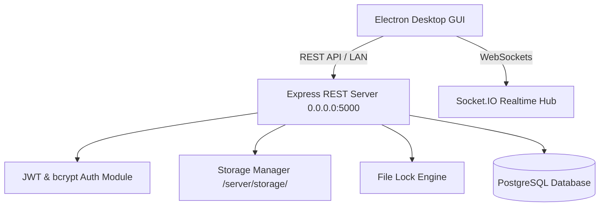

# Production Network File Server System

Enterprise-level, cross-platform GUI File Server System built with **Electron**, **React**, **Node.js/Express**, **PostgreSQL**, and **Socket.IO**. Designed for reliable multi-user access over Local Area Networks (LAN) with robust file operations, security, automatic SHA-256 duplicate detection, file versioning, file locking, and real-time audit logging.

---

## 🌟 Key Features Matrix

- **Client-Server LAN Architecture**: Desktop client connects to Express backend listening on `0.0.0.0:5000` via REST APIs and WebSockets.
- **Authentication & RBAC**: Password hashing using `bcryptjs`, JWT session tokens, and strict role permissions:
  - **Admin**: Manage storage capacity, view all users, delete any file, view full system audit logs.
  - **User**: Isolated visibility to own files, upload, download, rename, and lock own files.
- **Drag & Drop Upload Queue**: Multi-file drag and drop dropzone with individual progress bars.
- **SHA-256 Checksum Duplicate Detection**: Generates SHA-256 hash on upload and alerts user if identical content already exists.
- **Automatic File Versioning**: Uploading files with duplicate names automatically maintains version history (`resume.pdf` ➔ `resume_v2.pdf` ➔ `resume_v3.pdf`).
- **Resumable HTTP Range Downloads & Zip Archive**: Supports single file download with HTTP `Range` resumption and multi-file zip archiving.
- **Concurrent File Locking**: Prevents file modification/deletion when locked: Displays `"This file is currently locked by another user."`
- **Real-Time LAN Updates**: Socket.IO broadcasts live file additions, lock state changes, and audit logs.
- **Minimal Dark Theme UI**: High contrast, responsive dashboard focused on system utility and file management.

---

## 🛠️ Technology Stack

| Component | Technology |
|---|---|
| **Desktop Client** | Electron, React, Vite, Lucide Icons |
| **Packaging** | Electron Builder (Windows `.exe`, Linux `AppImage`) |
| **Backend API** | Node.js, Express.js |
| **Database** | PostgreSQL (with auto-migrating `schema.sql`) |
| **Authentication** | JWT, bcryptjs |
| **Realtime Communication** | Socket.IO |
| **File Upload** | Multer |
| **Archive Bundler** | Archiver |

---

## 🚀 Quick Start Guide

### 1. Start Backend Server

```bash
cd server
npm install
npm start
```
*The server automatically initializes database schema and listens on `http://0.0.0.0:5000`.*

### 2. Start Desktop Client Application

```bash
cd client
npm install
npm run electron:dev
```

### 🔑 Default Credentials

- **Admin User**: `admin@fileserver.com`
- **Password**: `Admin@123`

---

## 📐 System Architecture Diagram



---

## 📚 Complete Project Documentation

Detailed technical documents are available in the `docs/` folder:

- 🏗️ [Architecture & Component Specifications](file:///c:/FileServerProject/docs/ARCHITECTURE.md)
- 🗄️ [Database ER Diagram & Schema Reference](file:///c:/FileServerProject/docs/DATABASE_SCHEMA.md)
- 🔄 [Sequence Diagrams (Upload, Resumable Download, Locking)](file:///c:/FileServerProject/docs/SEQUENCE_DIAGRAMS.md)
- 🔌 [REST API Documentation](file:///c:/FileServerProject/docs/API_DOCUMENTATION.md)
- 📦 [Electron Packaging Guide (EXE & AppImage)](file:///c:/FileServerProject/docs/PACKAGING_GUIDE.md)
- 🌐 [LAN Network Deployment Guide](file:///c:/FileServerProject/docs/DEPLOYMENT_GUIDE.md)
- 🧪 [Verification & Testing Instructions](file:///c:/FileServerProject/docs/TESTING_INSTRUCTIONS.md)
- 📁 [Folder Structure Reference](file:///c:/FileServerProject/docs/FOLDER_STRUCTURE.md)
