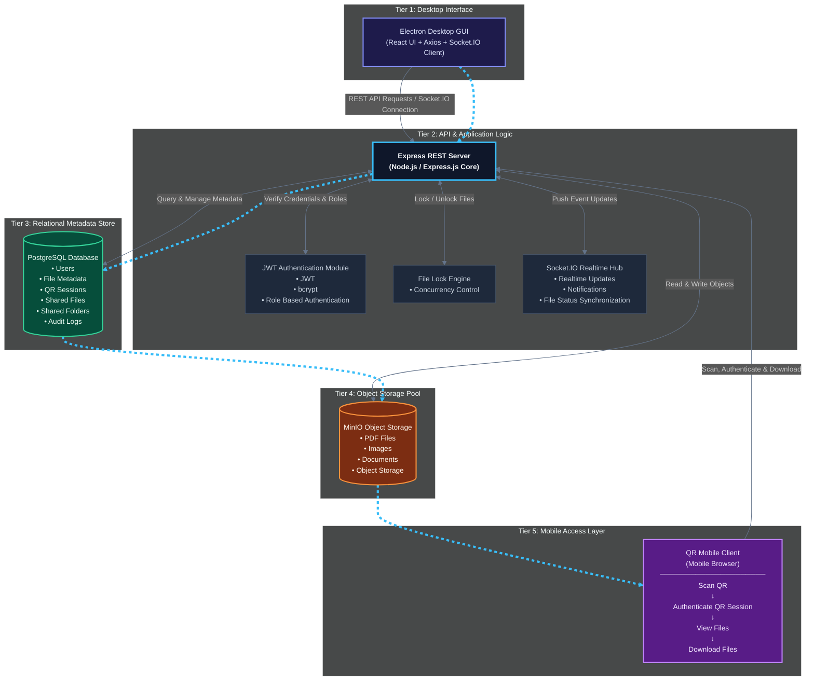

# System Architecture & Component Design

## High-Level Client-Server Architecture

## Security & Protection Layers

1. **Strict Path Traversal Protection**: Every file access verifies that resolved absolute file paths reside inside `/server/storage/`.
2. **Password Security**: Passwords salted and hashed with `bcryptjs`.
3. **Role-Based Access Control (RBAC)**: Admin role can view all users, view all files, delete any file, and view global audit logs. User role is strictly isolated to own files.
4. **File Locking**: Locks files being read/edited to prevent deletion by other users.
