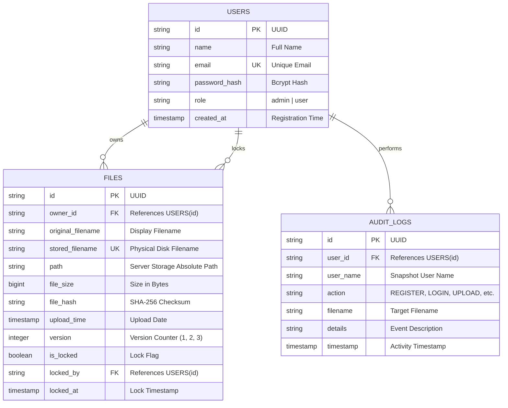

# Database ER Diagram & Schema Specifications

## Entity Relationship (ER) Diagram

## Table Definitions

### 1. `users`
- `id`: Primary key (UUID string)
- `name`: Full display name
- `email`: Unique email identifier
- `password_hash`: Bcrypt hash
- `role`: Role enum (`admin`, `user`)
- `created_at`: Creation timestamp

### 2. `files`
- `id`: Primary key (UUID string)
- `owner_id`: Foreign key referencing `users(id)`
- `original_filename`: Original uploaded filename or versioned name (`resume_v2.pdf`)
- `stored_filename`: Unique storage filename generated by UUID
- `path`: Full path location on server filesystem
- `file_size`: Size in bytes
- `file_hash`: SHA-256 checksum used for duplicate detection
- `version`: Version integer counter
- `is_locked`: Boolean lock flag
- `locked_by`: User ID holding the lock

### 3. `audit_logs`
- `id`: Primary key (UUID string)
- `user_id`: Foreign key referencing `users(id)`
- `user_name`: Cached name of user performing action
- `action`: Audit action code (`REGISTER`, `LOGIN`, `LOGOUT`, `UPLOAD`, `DOWNLOAD`, `RENAME`, `DELETE`, `SEARCH`, `LOCK`)
- `timestamp`: Action timestamp
