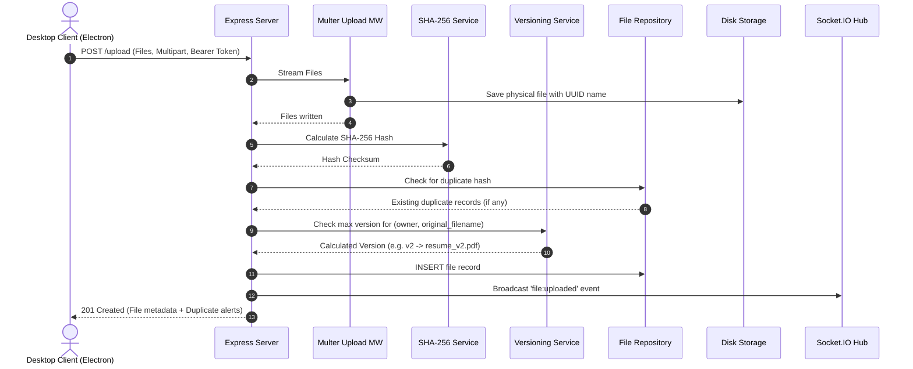
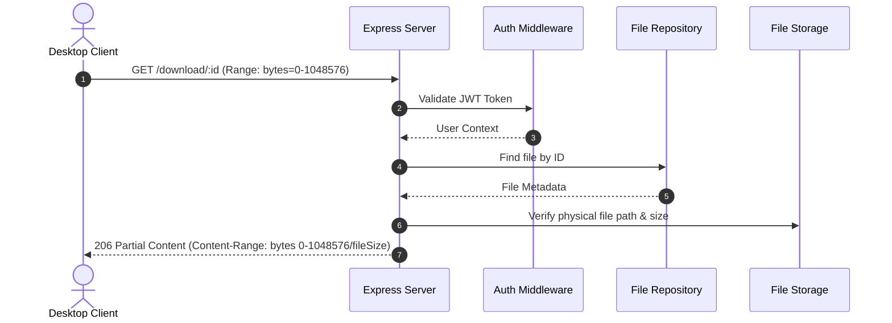
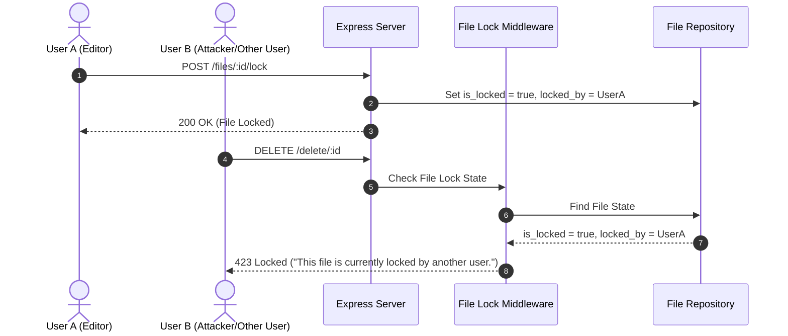

# System Sequence Diagrams

## 1. File Upload & SHA-256 Duplicate / Versioning Sequence

## 2. Resumable File Download & HTTP Range Request Sequence

## 3. File Locking & Delete Blocker Sequence

